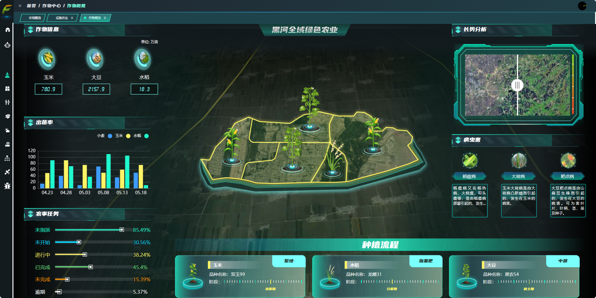
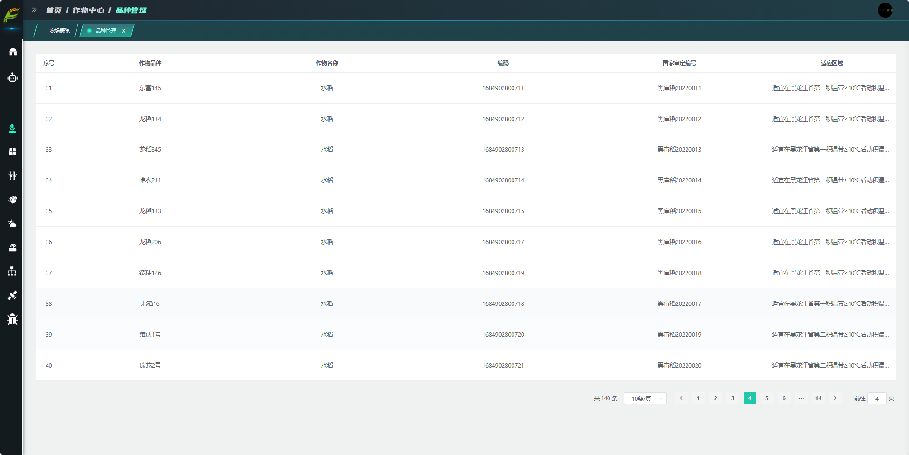
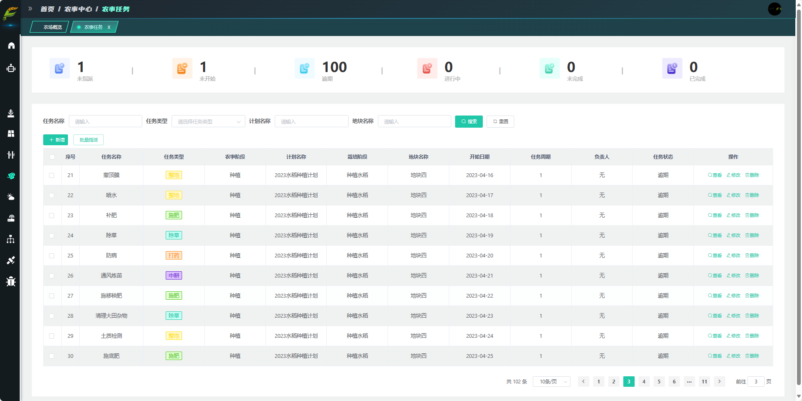

<h1 align="center" style="margin: 30px 0 30px; font-weight: bold;">智农伴飞开放平台</h1>
<h4 align="center">基于SpringBoot+Vue前后端分离的智慧农业平台</h4>

## 平台简介

>&nbsp;&nbsp;&nbsp;&nbsp;&nbsp;&nbsp;&nbsp;工大智研获科技部批复，牵头创建智农伴飞平台，作为国家级数字农业创新首例，开创智慧农业新篇章。该平台集成云端AI赋能、应用场景服务及农学知识图谱，全面革新农业科技，实现智能农业新跨越。平台致力于提升农业效能，增加农民收入，保障农产品安全，推动乡村振兴，为农业现代化提供强大科技支撑。
* 前端采用Vue3、Element UI。
* 后端采用Spring Boot、Spring Security、Redis & Jwt。
* 权限认证使用Jwt，支持多终端认证系统。
* 支持加载动态权限菜单，多方式轻松权限控制。

## 内置功能

1. 作物中心：管理农场的作物种类、品种选择以及积温带信息，这对于确保作物生长周期与当地气候条件相匹配至关重要。
2. 地块中心：详细记录和管理农场中每个地块的基本信息，如土壤类型、肥力水平、历史种植记录等，以便于制定种植计划和进行科学管理。
3. 种植中心：根据作物中心和地块中心提供的信息，配置具体的种植计划，包括作物布局、种植时间、预期收获时间等，并与特定地块绑定。
4. 农事中心：为种植计划配置农事任务，如播种、施肥、灌溉、病虫害防治等，并指派给农场员工执行，确保农业生产活动有序进行。
5. 气象中心：提供农场所在地区的气象信息服务，包括实时天气、天气预报以及历史气候数据，帮助农场主做出科学的种植决策。
6. 设备中心：维护农场中使用的各类农业设备的信息，如播种机、收割机、喷雾器等，确保设备处于良好的工作状态。
7. 农场中心：整合和管理通过各类农业设备收集的数据，如土壤湿度、作物生长状况等，为精准农业提供数据支持。
8. 系统管理：负责整个农业管理系统的用户权限分配、菜单配置和其他系统设置，确保系统的安全、稳定和高效运行。
## 后端部署
1. 准备工作
* JDK >= 11 (推荐11)
* Mysql >= 5.7.0 (推荐5.7版本)
* Redis >= 3.0
* Maven >= 3.0

2. 前往Gitee下载页面（xxxxxx）下载解压到工作目录
* 1、导入到Eclipse，菜单 File -> Import，然后选择 Maven -> Existing Maven Projects，点击 Next> 按钮，选择工作目录，然后点击 Finish 按钮，即可成功导入。
  Eclipse会自动加载Maven依赖包，初次加载会比较慢（根据自身网络情况而定）
* 2、创建数据库（xxxxx）并导入数据脚本SQLxxx1，SQLxxx2
* 3、打开项目运行com.airohit.agriculture.module.server.ServerApplication.java

## 前端部署
>[前端文档](agriculture-ui/README.md)
## 相关环境的部署

1. 系统环境
   >[部署文档](DEPLOY.md)

2. 必要配置
* 修改数据库连接  
  agriculture-admin-server/src/main/resources/bootstrap-dev.yml
  >
* 修改服务器配置
  agriculture-admin-server/src/main/resources/bootstrap-dev.yml
  >
* 修改天气接口配置  
  agriculture-admin-server/src/main/resources/bootstrap.yml
  >
* 环境变量
  agriculture-admin-server/src/main/resources/bootstrap-dev.yml
  >

## 系统截图
* 
* 
* 
* 
* 
* 
* 

